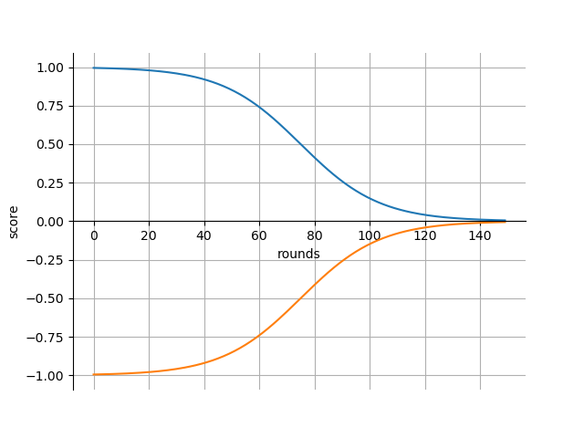

# Pandemie!

## Inhaltsverzeichnis
* [Einleitung](documentation.md#einleitung)
* [Grundlagen](documentation.md#grundlagen)
* [Installation](documentation.md#installation)
* [Schnellstart](documentation.md#schnellstart)
* [Wie benutze ich das Programm](documentation.md#wie-benutze-ich-das-programm)
* [Lösungsstrategien](documentation.md#lsungsstrategien)
* [Wissenschaftlicher Hintergrund](documentation.md#wissenschaftlicher-hintergrund)
* [Erklärung des Programmcodes](documentation.md#erklaerung-des-programmcodes)
* [API](documentation.md#api)
* [Software Architektur](documentation.md#software-architektur)
* [FAQ](documentation.md#faq)
* [Zusatzfunktion: Visualisierung](documentation.md#zusatzfunktion:-visualisierung)
* [Der Web service auf AWS](documentation.md#der-web-service-auf-AWS)
* [Warum unsere Idee die Beste ist.](documentation.md#warum-unsere-idee-die-beste-ist)
* [Auswertung der Ergebnisse](documentation.md#auswertung-der-ergebnisse)

## Einleitung
In dieser Dokumentation wird die Verwendung und Funktionsweise unserer Lösung des Problems des Informaticups 2019
beschrieben.<br>
Durch das bereitgestellte Programm `ic20_linux`*, welches von den Herausgebern des Informaticups zur Verfügung gestellt 
wird, wird eine Epedemie der Welt simuliert.
Ziel ist es, dass in möglichst kurzer Zeit, die Menschheit auf dem Planeten Erde überlebt und die Seuchen
ausgerottet werden. Diese Seuchen haben unterschiedliche Eigenschaften und treten zufällig auf.
Für die Lösung wurde unsererseits ein Webservice entwickelt, welcher in Kombination mit einer Lösungsstrategie dem
Programm `ic20_linux` rundenbasiert Antworten schickt, die dazu führen sollen, dass die Simmulation der Epedemie positiv
entschieden wird.<br>
Um das Verhalten des Simulationsprogramms zu analysieren und eine effektive Lösungsstrategie zu entwickeln, wurden
weitere Programme durch die Gruppe entwickelt.<br>
Des Weiteren enthält die von unserer Gruppe bereitgestellte Softwarelösung die Möglichkeit zur Visualisierung einer
abgeschlossenen Simulation.<br>

*Das Programm ist ebenfalls für Windows verfügbar und vom Betriebssystem abhängig implementiert.
## Grundlagen
Zu den Grundlagen gehört zunächst die vollständige und erfolgreiche Installation der Software. Daraufhin gibt es
einen Schnellstart zum Testen einer Strategie. Im Anschluss wird genauer darauf eingegangen, in welchem Umfang die zur
Verfügung stehenden Programme genutzt werden können. Dabei wird auch darauf eingegangen, wie eigene Strategien zu 
unserer Software kompatibel entwickelt und gestaltet werden können.
### Installation
Zunächst muss das Projekt aus dem Gitlab geklont werden. Dazu wird die Versionskontrollsoftware `git` benötigt.

Der Klonvorgang geschieht mit dem nachstehenden Aufruf.
```git
git clone https://gitlab.projekt.uni-hannover.de/chi-informaticup03/project-pandemie-03.git
```
Als grundlegende Software wird Python in der Version 3.8 vorrausgesetzt(`python3.8`). Dieses ist, je nachdem welches 
Betriebssystem verwendet wird, anders zu installieren.<br>
Des Weiteren sind einige Abhängigkeiten für die korrekte Ausführung des Programmcodes notwendig. Die Abhängigkeiten 
der Software sind in der Datei `requirements.txt` erfasst. Die Datei wird mit in dem Projektordner mitgeliefert und
befindet sich auf der höchsten Hirarchieebene. Die Abhängigkeiten können mit der Software `pip3.8` installiert werden.

Mit dem Aufruf eines Befehls ist das automatische Installieren möglich.
```bash
pip3.8 install -r requirements.txt
```

### Schnellstart
Um den Tester für das `ic20_linux` Programm auszuführen, kann in dem Projektordner folgender Befehl aufgerufen werden.
```bash
python3.8 -m pandemie.tester
```
Für die schnelle Ausführung des Programms sind bereits Standard-Parameter gesetzt. Diese können per aufgefordeter
Terminaleingabe auch geändert werden. Dazu mehr in der Sektion 
[Wie benutze ich das Programm](documentation.md#wie-benutze-ich-das-programm).
Mit den Standard-Parametern wird das `ic20_linux` Programm in 5 Instanzen ausgeführt und gegen die zuletzt von uns
entwickelte Strategie getestet. Wie gut die Strategie ist, wird nach Abschluss der Berechnungen auf dem Terminal als
`win rate` ausgegeben. Zusätzlich kann der `score` zur Bewertung herangezogen werden, welcher neben dem Erfolg der
Strategie auch die Anzahl der Runden bis zum Sieg bzw. Niederlage des Spiels einbezieht.
## Wie benutze ich das Programm
Nach der Installation des Programms und einem einfachen Ausführungsbeispiel wird nun die Verwendung der einzelnen 
Funktionen des Programms erklärt.
### Den Tester richtig nutzen
Zum Testen von Strategien ist das Modul `tester.py` vorgesehen. Hier werden verschiedene Funktionalitäten zum 
Analysieren und Testen eigener Strategien bereitgestellt. Um eigene Strategien zu testen, muss lediglich das Modul
`tester.py` aus dem Projektordner heraus ausgeführt werden. <br>
```bash
python3.8 -m pandemie.tester
```
<br>Der Tester kann mit verschiedenen Optionen über die Kommandozeile konfigurieren werden. Diese kann man sich so 
anzeigen lassen:
```bash
> python3.8 -m pandemie.tester -h
-h --help            show the help
-o --optimize        enable optimization for the final strategy
-s                   add the full name of the strategy you want to test (no .py) (default=final)
-l --log             write down log of run
-v --visualization   save visualization data for one thread
-t                   how many simulations should be run simultaneously? (default=5)
-u --user_seed       uses a predefined seed for all games, if not set a random seed is used
```
Im folgenden werden die einzelnen Optionen erläutert.
Der Tester implementiert die Möglichkeit die Gewichte einer Strategie mittels einer `Bayesian optimization` anzupassen.
Dazu wird über die Kommandozeile die `-o` bzw. die `--optimize` Option angegeben. Aktuell ist es nur möglich die `final`
Strategie zu optimieren. Dabei werden alle anderen Parameter verworfen.

Möchte man eine andere Strategie testen so muss man den vollständigen Namen der Strategie der `-s` Option übergeben.
Die auszuführenden Strategie muss im `/pandemie/tester/strategies` Ordner liegen und von der `AbstractStrategy` erben.

Die `-l` oder `--log` Flag aktiviert das Erstellen eines Log. Das Loggen beinhaltet das Ergebnis und die Anzahl der 
Runden, die bis zu diesem Ergebnis gespielt wurden, für jedes einzelne gespielte Spiel. Außerdem werden für jedes Spiel
alle aufgetretenen Pathogene inklusive ihrer Eigenschaften geloggt. Am Ende der Log-Datei steht dann der berechnete
Score der Strategie. Dieser befindet sich immer zwischen 1 und -1, wobei 1 ein perfekter Score wäre.<br>
Hier ein Beispiel für die Strategie `example_strategy.py` mit zwei gespielten Runden:<br>
```
$loss:	11
{'name': 'N5-10', 'infectivity': '+', 'mobility': '++', 'duration': 'o', 'lethality': '+'}
{'name': 'Admiral Trips', 'infectivity': '++', 'mobility': '+', 'duration': '-', 'lethality': '++'}
{'name': 'Plorps', 'infectivity': 'o', 'mobility': 'o', 'duration': '+', 'lethality': '-'}

$win:	26
{'name': 'Shanty', 'infectivity': '+', 'mobility': '-', 'duration': 'o', 'lethality': '-'}
{'name': 'Phagum vidiianum', 'infectivity': 'o', 'mobility': 'o', 'duration': '+', 'lethality': '+'}

-0.1635815380187609
```
<br>Um die statistische Aussagekraft eines Testdurchlaufes zu erhöhen, kann man mit der `-t` Option die Anzahl der
parallel durchgeführten Spieldurchläufe festlegen. Die maximale Anzahl der Threads ist auf 500 beschränkt. Bei
zu hoher Anzahl der Threads können Komplikationen auftreten. Der Webserver kann dann nicht alle Anfragen korrekt
auswerten und es werden Requests falsch verarbeitet.

Um die Testdurchläufe vergleichbar zu machen, kann man einen festen Seed übergeben. Dies geschieht mittels der `-u`
bzw. der `--user_seed` Option.

Um das Zusatzfeature Visualisierung zu benutzen, müssen zuvor die Daten einer Runde gespeichert werden. Dazu muss die
`-v` oder die `--visualization` Flag gesetzt werden. Dadurch wird die Anzahl der Threads auf eins gesetzt und die Daten
passend vorbereitet.
Die Visualisierung dient wie auch das Loggen dem Analysieren und Verstehen der Strategie. Wie die Visualisierung 
funktioniert, wird detailliert im Kapitel 
[Zusatzfunktion: Visualisierung](documentation.md#zusatzfunktion:-visualisierung) erläutert.

### Standardeinstellungen des Testers
Die Standardeinstellungen sind wie folgend:
 * Es wird die `final` Strategie benutzt
 * Kein Log-Output wird erstellt
 * Die Runden werden nicht visualisiert
 * Es werden 5 Spiele gleichzeitig gespielt
 * Für jedes Spiel wird ein zufälliger Seed generiert

#### Daten-Analyse-Tools
Zum Sammeln von Daten über Vieren und Events sind in `tester.py` bereits verschieden Funktionalitäten integriert.

Das Modul `event_checker.py` dient dem Sammeln von allgemeinen Daten, die zum Erstellen einer guten Strategie essenziell 
sind. Dabei filtert das Modul die gesamten Rohdaten einer Runde und überprüft diese auf bisher unbekannte Pathogen- und 
Event-Typen.

Das Modul `analyse_log.py` analysiert wenn Logging aktiviert ist die übergebene Log-Datei. Hierbei wird für jedes
bekannte Pathogen analysiert wie viele Spiele gewonnen und verloren wurden, wenn dieses Pathogen aufgetreten ist.

##### Der Event-Checker
Das manuelle Einbinden des Moduls ist nicht notwendig. Das Modul wird bereits in `strategy.py` eingebunden und ist somit 
standardmäßig in jeder Strategie beinhaltet und kann nicht ohne Änderungen an `strategy.py` deaktiviert oder entfernt 
werden.


Die bekannten Pathogen- und Eventnamen werden in der Datei `pandemie/tester/data/pathogen_names.dat` bzw.
`pandemie/tester/data/event_names.dat` gespeichert.
Zusätzlich zu den Namen werden für jedes Pathogen und jedes Event auch ein Beispiel für die Eigenschaften gespeichert. 
Die Daten werden dann in `pandemie/tester/data/pathogen_data.dat` bzw. `pandemie/tester/data/event_data.dat` 
gespeichert.
<br>Beispiel für gesammelte Pathogen-Daten:<br>
```
N5-10
{'name': 'N5-10', 'infectivity': '+', 'mobility': '++', 'duration': 'o', 'lethality': '+'}

Azmodeus
{'name': 'Azmodeus', 'infectivity': 'o', 'mobility': 'o', 'duration': 'o', 'lethality': 'o'}

Xenomonocythemia
{'name': 'Xenomonocythemia', 'infectivity': '-', 'mobility': '--', 'duration': 'o', 'lethality': '++'}
```
<br>Beispiel für gesammelte Event-Daten:<br>
```
outbreak	, local
{'type': 'outbreak', 'pathogen': {'name': 'Xenomonocythemia', 'infectivity': '-', 'mobility': '--', 'duration': 'o', 'lethality': '++'}, 'prevalence': 0.06321243523316063, 'sinceRound': 1}

pathogenEncountered	, global
{'type': 'pathogenEncountered', 'pathogen': {'name': 'N5-10', 'infectivity': '+', 'mobility': '++', 'duration': 'o', 'lethality': '+'}, 'round': 1}

medicationInDevelopment	, global
{'type': 'medicationInDevelopment', 'pathogen': {'name': 'N5-10', 'infectivity': '+', 'mobility': '++', 'duration': 'o', 'lethality': '+'}, 'sinceRound': 1, 'untilRound': 4}
```

##### Die Log-Analyse
Das manuelle Einbinden des Moduls `analyse_log.py` ist nicht notwendig. Das Modul wird standardmäßig ausgeführt wenn
Logging aktiviert ist. Es ist nicht möglich das Modul zu deaktivieren oder zu entfernen ohne Änderungen an `tester.py`
vorzunehmen. 

Die gesammelten Daten werden zum Ende der übergebenen Log-Datei hinzugefügt. Hierbei werden alle nicht-UTF-8-Zeichen
entfernt, um mögliche Konflikte zu vermeiden.
<br>Beispiel für gesammelte Daten:<br>
```
Admiral Trips                  	-	wins: 9 - loss: 18
Azmodeus                       	-	wins: 1 - loss: 8
Coccus innocuus                	-	wins: 5 - loss: 8
Endoictus                      	-	wins: 8 - loss: 12
Hexapox                        	-	wins: 4 - loss: 14
Influenza iutiubensis          	-	wins: 5 - loss: 8
Methanobrevibacter colferi     	-	wins: 6 - loss: 9
Moricillus                     	-	wins: 5 - loss: 20
N5-10                          	-	wins: 11 - loss: 18
Neurodermantotitis             	-	wins: 3 - loss: 12
Phagum vidiianum               	-	wins: 4 - loss: 25
Plorps                         	-	wins: 2 - loss: 10
Procrastinalgia                	-	wins: 6 - loss: 5
Rhinonitis                     	-	wins: 6 - loss: 11
Saccharomyces cerevisiae mutans	-	wins: 10 - loss: 12
Shanty                         	-	wins: 5 - loss: 3
thisis                         	-	wins: 7 - loss: 9
Xenomonocythemia               	-	wins: 16 - loss: 10
```
## Lösungsstrategien
Eine Strategie bezeichnet in unserem Kontext eine Implementierung, um auf den aktuellen Spielstand zustandslos zu 
antworten.
### Die Scorefunktion
Im Hinblick auf eine Vergleichbarkeit der verschiedenen Strategien, eventuell später auch in Abhängigkeit von ihren
Gewichten, bietet es sich an, eine Score Funktion zu erstellen, die es ermöglicht einer Runde einen Score Wert zu geben.
Um die Score Funktion über mehrere Runden hinweg zu benutzen, geben wir gewonnenen Runden einen positiven Score und 
verlorenen einen negativen. So kann man den Durchschnitt über alle Spiele als Gesamtscore benutzen.<br>
Die Idee hinter den Score Funktionen, also die Funktionen die in Abhängigkeit der Spiellänge den Score erstellen, ist,
dass verlorenene Spiel mit eine längeren Spieldauer besser sind als Spiele die schnell verloren gehen. Bei gewonnenen
Spielen ist es umgekehrt, je schneller gewonnen wird, desto besser.<br><br>
Hier die aktuell genutzen Funktionen. In blau ist die Funktion für die gewonnen Runden dargestellt, in orange die für
verlorene.<br><br>
<br><br>
Grundsätzlich gilt, dass 1 ein perfekter Score ist und -1 der schlechteste. Bei 75 Runden ist der jeweilige Score
halbiert, also nach 75 gewonnene Runden bekommt das Spiel den Score 0.5 und ein verlorenes -0.5. Dieses Wert ist, 
genauso wie der Grad der Steigung, nur durch Änderungen im Quellcode anpassbar.<br>
### Unsere Strategie
Unsere Teamstrategie kann in `final.py` gefunden werden. Im Folgenden bezeichnen "Maßnahmen" eine mögliche Aktion zur 
Veränderung des Spielstandes (bspw.: put_under_quarantine) und "Operationen" konkret angewandte Maßnahmen im Spiel
(bspw. ("put_under_quarantine", city, pathogen)). Die Strategie besteht grundlegend aus drei Phasen: Preprocessing, 
Ranking nach Operation und Ranking nach Maßname. Im ersten Schritt wird der Spielzustand analysiert und neu in Listen 
bzw. Dicts abgespeichert. Zum Beispiel werden den Städten und Pathogenen einige neue Parameter zugeordnet und nach
diesen sortiert. Im nächsten Schritt wird innerhalb einer Maßnahme die beste Operation gesucht. Dies führt am Ende dazu,
dass für jede Maßnahme eine Operation als beste Option auserkoren wird. Im letzten Schritt werden die Operationen in die
abschließende Reihenfolge gebracht, an deren erster Stelle die Operation steht, die ausgeführt wird. Kann die Operation
aufgrund mangelnder Punkte nicht ausgeführt werden, muss die Runde beendet werden.
#### Beobachtungen bei der Entwicklung
Bei der Entwicklung unserer Teamstrategie haben wir einige Beobachtungen gemacht, die es erleichtern, eigene Strategien
zu entwickeln. Diese werden im folgenden aufgeführt:
 * Jede Stadt kann nur von einem Pathogen gleichzeitig befallen werden
 * Die Punkte für eine Operation werden für die angegebene Rundenzahl im Voraus bezahlt
### Eigene Strategien entwickeln
Alle Strategien erben von der Klasse `AbstractStrategy` und implementieren die Methode `_solve()`. Diese ist das
Herzstück jeder Strategie, da in ihr abhängig von dem aktuellen Spielstand im JSON-Format über die Antwort und damit die
Güte der Strategie entschieden wird. Um die Umsetzung einer eigenen Strategie zu erleichtern, existiert das Modul 
`operations.py`, welches alle möglichen Operationen im vorgegebenen JSON-Format und deren Preise beinhaltet. Zudem kann
eine Operation auch mit einem Tupel angegeben werden. Dies kann zum Beispiel nützlich sein, um wie in unserer 
Teamstrategie bestimmte Operationen zu ranken und auf Basis einer Sortierung eine Auswahl zu treffen.
## Wissenschaftlicher Hintergrund
## Erklaerung des Programmcodes
Der gesamte Code ist mit PyDoc dokumentiert. Diese Dokumentation kann wie folgt generiert werden:
```bash
python3.8 -m pydoc -n <hostname> -p <port> pandemie
```
Einige Module lassen sich leider nicht automatisch generieren, da sie auf Ornder relativ zum Pfad zugreifen.
Innerhalb der einzelnen Modulfunktionen sind zusätzlich einzelne Schritte kommentiert, um die Funktionsweise der Module 
nachvollziehen zu können. Hierbei halten wir uns an die gängigen Standardkonventionen.
## API
## Software Architektur
## FAQ
(Marvin)
### Wie kann man das Team kontaktieren?
Siehe [Autoren](documentation.md#autoren).
### Wie ist das Projekt lizensiert?
Das Projekt ist mit der MIT Lizenz lizensiert und damit eine Open-Source Software. Die Lizenz für dieses Projekt
befindet sich in der Datei `LICENSE.md`.<br>
Des Weiteren sind die verwendeten Abhängigkeiten alle der MIT oder BSD Lizenz zugeordnet.
## Zusatzfunktion: Visualisierung
Zur Analyse und zum Vergleich verschiedener Strategien ist es sinnvoll, diese zu visualisieren. Dazu werden entweder
einzelne Runden oder das gesamte Spiel mithilfe von verschiedenen Graphen oder Karten dargestellt. Hiermit können 
Stärken und Schwächen einer Strategie ausgemacht werden und so eine Verbesserung des Scores erzielt werden. Zudem sollen
Strategien von Grund auf neu entwickelt werden können. Dies ist ein iterativer Prozess, welcher schlussendlich zu einer 
Strategie führen kann, welche auf verschiedene Ereignisse angemessen reagiert und eine gute Erfolgswahrscheinlichkeit
an den Tag legt. Für den Zweck der Entwicklung unserer Teamstrategie existiert bereits die Implementierung zur 
Darstellung einiger Graphen und Karten. Im Folgenden wird erklärt, wie auf diese zugegriffen werden kann und wie eigene 
Erweiterungen realisiert werden können.
### Wie starte ich die Visualisierung
Um die Visualisierung zu starten muss zunächst mindestens einmal der 
[Tester](documentation.md#den-tester-richtig-nutzen) mit der Visualisierungs-Option gestartet werden. Dies führt dazu, 
dass im Ordner `pandemie/visualization/logs` die JSON-Dateien der einzelnen Runden abgelegt werden. Ist diese 
Voraussetzung erfüllt, kann die Visualisierung mit dem Modul `visualization.py` gestartet werden: <br>
```bash
$ python3.8 -m pandemie.visualization
```
Sobald die Visualisierung fertig ist, wird anschließend ein Webserver gestartet, welcher über `localhost:8050`
aufgerufen werden kann. Im Log wird hierzu auch ein Link angezeigt. Wenn die Seite aufgerufen wird, kann oben im
Dropdown-Menü ausgewählt werden, welche Runde oder ob das gesamte Spiel visualisiert werden soll.
### Eigene Visualisierung hinzufügen
Die Visualisierung wird mithilfe von `Plotly` mit `Dash` als Dashboard Anwendung realisiert. Plotly kann also dazu 
genutzt werden, eigene Visualisierungen einzubinden. Hierbei soll zwischen Preprocessing und der eigentlichen 
Darstellung unterschieden werden, wobei ersteres in `preprocessing.py` und letzteres in `visualization.py` stattfindet. 
<br> Soll eine Visualisierung für das gesamte Spiel hinzugefügt werden, so muss das Preprocessing in der Funktion 
`preprocess_game` stattfinden. Hier können benötigte Lists/Dicts erstellt und mithilfe der jeweiligen JSON-Datei
generiert werden. Anschließend sollen generierte Daten in dem Dict `game_visualizations` abgelegt werden, um später auf
sie zuzugreifen. Analog können für einzelne Runden in der Funktion `preprocess_round` Daten gesammelt und in dem Dict 
`round_visualizations[<Runden-Nummer>]` gespeichert werden.<br>
In `visualization.py` kann nun eine Funktion hinzugefügt werden, welche einen 
[Dash component](https://dash.plot.ly/dash-core-components) zurückgibt, was ein Graph aber auch andere GUI-Elemente sein
können. Zusätzlich muss in der Funktion `visualize_game` der entsprechende Funktionsaufruf der zurückgegebenen Liste 
hinzugefügt werden. Die Visualisierungen werden entsprechend der Reihenfolge in dieser Liste untereinander angezeigt.
Für die Visualisierung einzelner Runden kann hierfür analog die Funktion `visualize_round` verwendet werden.
## Der Web Service auf AWS
Unser Webservice ist auf Amazon AWS auf dem Elastic Compute Cloud Server (EC2) aufgesetzt. Der Webservice ist dabei
unsrer Projekt in sehr abgespeckter Version.

Dabei wird unser Service zur Beantwortung von Anfragen des `ic_20`-Tools permanent gestartet. Auf diesem läuft,
ohne des es beeinflussbar wäre, unser Dienst mit unserer letzen, besten Lösungsstrategie.

## Warum unsere Idee die Beste ist
In unserem Ansatz zur optimalen Strategie die Menschheit vor dem Untergang zu retten, kombinieren wir die Gewichtung von
Maßnahmen mit unserem empirischen Erfahrungsschatz über die ausbrechenden Seuchen und Krankheiten.

Zunächst werden alle Ereignisse einer Runde analysiert und lokal abgespeichert. Anschließend werden, basierend auf der
Art der Bedrohung, alle möglichen Reaktionen der Menschheit faktorisiert. Diese Faktoren richten sich mitunter nach
unserer erprobten Erfahrung. Nicht zuletzt wird anhand der verfügbaren Reaktionen die Eine, oder Mehrere Aktionen
durchgeführt um die Menscheit zu retten.

Alles in allem kombinieren wir mit unserer Idee unsere Erfahrung aus den analysierten Ereignissen mit einer
gewichtsverteilten Strategie. Damit verfolgen wir zuverlässig unser Ziel, die Menschheit vor den modernen Bedrohungen
unserer Zeit zu schützen.
## Auswertung der Ergebnisse
## Autoren
* Nils Langius (nils@langius.de)
* Ruwen Sadocco (ruwen.sadocco11@gmail.com)
* Marvin Sextro (marvin.sextro@stud.uni-hannover.de)
* Alexander Krause (krause@finf.uni-hannover.de)