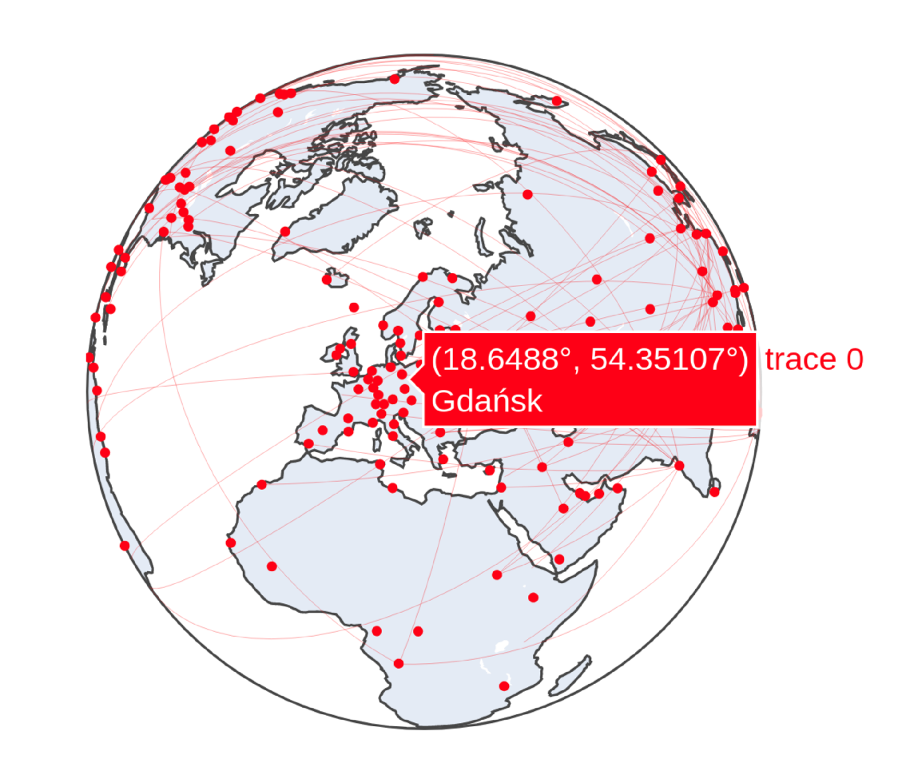

# Pandemie!

## Inhaltsverzeichnis
* [Einleitung](documentation.md#einleitung)
* [Grundlagen](documentation.md#grundlagen)
* [Installation](documentation.md#installation)
* [Schnellstart](documentation.md#schnellstart)
* [Benutzung des Programms](documentation.md#benutzung-des-programms)
* [Lösungsstrategien](documentation.md#lsungsstrategien)
* [Wissenschaftlicher Hintergrund](documentation.md#wissenschaftlicher-hintergrund)
* [Code-Dokumentation](documentation.md#code-dokumentation)
* [Software Architektur](documentation.md#software-architektur)
* [FAQ](documentation.md#faq)
* [Zusatzfunktion: Visualisierung](documentation.md#zusatzfunktion:-visualisierung)
* [Der Web service](documentation.md#der-web-service)
* [Warum unsere Idee die Beste ist.](documentation.md#warum-unsere-idee-die-beste-ist)
* [Auswertung der Ergebnisse](documentation.md#auswertung-der-ergebnisse)

## Einleitung
In dieser Dokumentation wird die Verwendung und Funktionsweise unserer Lösung des Problems des Informaticups 2019
beschrieben.<br>
Durch das bereitgestellte Programm `ic20_linux`*, welches von den Herausgebern des Informaticups zur Verfügung gestellt 
wird, wird eine Pandemie simuliert.
Ziel ist es, dass in möglichst kurzer Zeit, die Menschheit auf dem Planeten Erde überlebt und die Seuchen
ausgerottet werden. Diese Seuchen haben unterschiedliche Eigenschaften und treten zufällig auf.
Für die Lösung wurde unsererseits ein Webservice entwickelt, welcher in Kombination mit einer Lösungsstrategie dem
Programm `ic20_linux` rundenbasiert Antworten schickt, die dazu führen sollen, dass die Simulation der Pandemie positiv
entschieden wird.<br>
Um das Verhalten des Simulationsprogramms zu verstehen und eine effektive Lösungsstrategie zu entwickeln, wurden
weitere Programme zu Analysezwecken entwickelt.<br>
Des Weiteren enthält die von unserer Gruppe bereitgestellte Softwarelösung die Möglichkeit zur Visualisierung einer
abgeschlossenen Simulation.<br>

*Das Programm ist ebenfalls für Windows verfügbar und vom Betriebssystem abhängig implementiert.

## Grundlagen
Zu den Grundlagen gehört zunächst die vollständige und erfolgreiche Installation der Software. Daraufhin gibt es
einen Schnellstart zum Testen einer Strategie. Im Anschluss wird genauer darauf eingegangen, in welchem Umfang die zur
Verfügung stehenden Programme genutzt werden können. Dabei wird auch darauf eingegangen, wie eigene Strategien zu 
unserer Software kompatibel entwickelt und gestaltet werden können.

### Installation
Zunächst muss das Projekt aus dem Gitlab geklont werden. Dazu wird die Versionskontrollsoftware `git` benötigt.

Der Klonvorgang geschieht mit dem nachstehenden Aufruf.
```git
git clone https://gitlab.projekt.uni-hannover.de/chi-informaticup03/project-pandemie-03.git
```
Als grundlegende Software wird Python in der Version 3.8 vorausgesetzt (`python3.8`). Dieses ist, je nachdem welches 
Betriebssystem verwendet wird, anders zu installieren. Die Neueste Version von Python 3.8 ist unter 
[python.org](https://www.python.org/downloads/) zu finden.<br>
Des Weiteren sind einige Abhängigkeiten für die korrekte Ausführung des Programmcodes notwendig. Die Abhängigkeiten 
der Software sind in der Datei `requirements.txt` erfasst. Die Datei wird mit in dem Projektordner mitgeliefert und
befindet sich auf der höchsten Hierarchieebene. Die Abhängigkeiten können mit der Software `pip3.8` installiert werden.

Mit dem Aufruf eines Befehls ist das automatische Installieren aller Abhängigkeiten möglich.
```bash
pip3.8 install -r requirements.txt
```

### Schnellstart
Um den Tester für das `ic20_linux`* Programm auszuführen, kann in dem Projektordner folgender Befehl aufgerufen werden.
```bash
python3.8 -m pandemie.tester
```
Für die schnelle Ausführung des Programms sind bereits Standard-Parameter gesetzt. Diese können per aufgeforderter
Terminaleingabe auch geändert werden. Dazu mehr in der Sektion 
[Benutzung das Programm](documentation.md#benutzung-des-programms).
Mit den Standard-Parametern wird das `ic20_linux` Programm in 5 Instanzen ausgeführt und gegen die zuletzt von uns
entwickelte Strategie getestet. Wie gut die Strategie ist, wird nach Abschluss der Berechnungen auf dem Terminal als
`win rate` ausgegeben. Zusätzlich kann der [`score`](documentation.md#die-scorefunktion) zur Bewertung herangezogen 
werden, welcher neben dem Erfolg der Strategie auch die Anzahl der Runden bis zum Sieg bzw. Niederlage des Spiels einbezieht.

*Für Windows genau so ausführbar, das Programm erkennt das genutzte Betriebssystem und führt dementsprechend das 
richtige tool aus

## Benutzung des Programms
Nach der Installation des Programms und einem einfachen Ausführungsbeispiel wird nun die Verwendung der einzelnen 
Funktionen des Programms detailiert erklärt.

### Den Tester richtig nutzen
Zum Testen von Strategien ist das Modul `pandemie/tester/tester.py` vorgesehen. Hier werden verschiedene
Funktionalitäten zum Analysieren und Testen eigener Strategien bereitgestellt. Um eigene Strategien zu testen, muss 
lediglich das Modul `tester.py` aus dem Projektordner heraus ausgeführt werden. <br>
```bash
python3.8 -m pandemie.tester
```
<br>Der Tester kann mit verschiedenen Optionen über die Kommandozeile aufgerufen werden. Um eine Liste aller Parameter
zu erhalten muss der Tester mit dem Parameter `-h` bzw. `--help` aufgerufen werden:
```bash
$ python3.8 -m pandemie.tester -h
-h --help            show the help
-o --optimize        enable optimization for the final strategy
-s                   add the full name of the strategy you want to test (no .py) (default=final)
-l --log             write down log of run
-v --visualization   save visualization data for one thread
-t                   how many simulations should be run simultaneously? (default=5)
-u --user_seed       uses a predefined seed for all games, if not set a random seed is used
```
Im Folgenden werden die einzelnen Optionen erläutert.
Der Tester implementiert die Möglichkeit die Gewichte einer Strategie mittels einer `Bayesian optimization` anzupassen.
Dazu wird über die Kommandozeile die `-o` bzw. die `--optimize` Option angegeben.<br>
> :warning: **Aktuell ist es nur möglich die `final` Strategie zu optimieren.** Sobald der Parameter `-o` oder 
`--optimize` übergeben wird, werden alle anderen Parameter verworfen.

Möchte man eine andere Strategie testen, so muss man den vollständigen Namen der Strategie der `-s` Option übergeben.
Es ist drauf zu achten, dass die auszuführenden Strategie im `/pandemie/tester/strategies` Ordner liegen. Auch muss die 
Strategie von der `AbstractStrategy` erben und die Methode `_solve()` implementieren. Wie genau eigene Strategien 
entwickelt werden können wird im Kapitel [eigene Strategien entwickeln](documentation.md#eigene-strategien-entwickeln)
erläutert.

Die `-l` oder `--log` Flag aktiviert das Erstellen eines Logs. Das Loggen beinhaltet das Ergebnis und die Anzahl der 
Runden, die bis zu diesem Ergebnis gespielt wurden, für jedes einzelne gespielte Spiel. Außerdem werden für jedes Spiel
alle aufgetretenen Pathogene inklusive ihrer Eigenschaften geloggt. Am Ende der Log-Datei steht dann der berechnete
Score der Strategie. Dieser befindet sich immer zwischen 1 und -1, wobei 1 ein perfekter Score wäre.<br>
Hier ein Beispiel für die Strategie `pandemie/tester/strategies/example_strategy.py` mit zwei gespielten Spielen:<br>
```
$loss:	11
{'name': 'N5-10', 'infectivity': '+', 'mobility': '++', 'duration': 'o', 'lethality': '+'}
{'name': 'Admiral Trips', 'infectivity': '++', 'mobility': '+', 'duration': '-', 'lethality': '++'}
{'name': 'Plorps', 'infectivity': 'o', 'mobility': 'o', 'duration': '+', 'lethality': '-'}

$win:	26
{'name': 'Shanty', 'infectivity': '+', 'mobility': '-', 'duration': 'o', 'lethality': '-'}
{'name': 'Phagum vidiianum', 'infectivity': 'o', 'mobility': 'o', 'duration': '+', 'lethality': '+'}

-0.1635815380187609
```
<br>Um die statistische Aussagekraft eines Testdurchlaufes zu erhöhen, kann man mit der `-t` Option die Anzahl der
parallel durchgeführten Spieldurchläufe festlegen. Die maximale Anzahl der Threads ist auf 500 beschränkt. Bei
zu hoher Anzahl der Threads können Komplikationen auftreten, sodass der Webserver nicht alle Anfragen korrekt
auswerten kann und Requests falsch verarbeitet werden.

Um die Testdurchläufe vergleichbar zu machen, kann man einen festen Seed übergeben. Dies geschieht mittels der `-u`
bzw. der `--user_seed` Option.

Um das Zusatzfeature Visualisierung zu benutzen, müssen zuvor die Daten einer Runde gespeichert werden. Dazu muss die
`-v` oder die `--visualization` Flag gesetzt werden. Dadurch wird die Anzahl der Threads auf eins gesetzt und die Daten
passend vorbereitet.
Die Visualisierung dient wie auch das Loggen dem Analysieren und Verstehen der Strategie. Wie die Visualisierung 
funktioniert, wird detailliert im Kapitel 
[Zusatzfunktion: Visualisierung](documentation.md#zusatzfunktion:-visualisierung) erläutert.

### Standardeinstellungen des Testers
Die Standardeinstellungen sind wie folgend:
 * Es wird die `final` Strategie benutzt
 * Kein Log-Output wird erstellt
 * Die Runden werden nicht visualisiert
 * Es werden 5 Spiele gleichzeitig gespielt
 * Für jedes Spiel wird ein zufälliger Seed generiert

#### Daten-Analyse-Tools
Zum Sammeln von Daten über Vieren und Events sind in `tester.py` bereits verschieden Funktionalitäten integriert.

Das Modul `event_checker.py` dient dem Sammeln von allgemeinen Daten, die zum Erstellen einer guten Strategie essenziell 
sind. Dabei filtert das Modul die gesamten Rohdaten einer Runde und überprüft diese auf bisher unbekannte Pathogen- und 
Event-Typen.

Das Modul `analyse_log.py` analysiert, wenn Logging aktiviert, ist die übergebene Log-Datei. Hierbei wird für jedes
bekannte Pathogen analysiert wie viele Spiele gewonnen und verloren wurden, wenn dieses Pathogen aufgetreten ist.

##### Der Event-Checker
Das manuelle Einbinden des Moduls ist nicht notwendig. Das Modul wird bereits in `pandemie/tester/strategy.py` 
eingebunden und ist somit standardmäßig in jeder Strategie beinhaltet und kann nicht ohne Änderungen an 
`pandemie/tester/strategy.py` deaktiviert oder entfernt werden.

Die bekannten Pathogen- und Eventnamen werden in der Datei `pandemie/tester/data/pathogen_names.dat` bzw.
`pandemie/tester/data/event_names.dat` gespeichert.
Zusätzlich zu den Namen werden für jedes Pathogen und jedes Event auch ein Beispiel für die Eigenschaften gespeichert. 
Die Daten werden dann in `pandemie/tester/data/pathogen_data.dat` bzw. `pandemie/tester/data/event_data.dat` 
gespeichert.
<br>Beispiel für gesammelte Pathogen-Daten:<br>
```
N5-10  # Name des Pathogens
{'name': 'N5-10', 'infectivity': '+', 'mobility': '++', 'duration': 'o', 'lethality': '+'}  # Eigenschaften des Pathogens

Azmodeus
{'name': 'Azmodeus', 'infectivity': 'o', 'mobility': 'o', 'duration': 'o', 'lethality': 'o'}

Xenomonocythemia
{'name': 'Xenomonocythemia', 'infectivity': '-', 'mobility': '--', 'duration': 'o', 'lethality': '++'}
```
<br>Beispiel für gesammelte Event-Daten:<br>
```
outbreak	, local     # Name des Events, globales oder lokales Event
{'type': 'outbreak', 'pathogen': {'name': 'Xenomonocythemia', 'infectivity': '-', 'mobility': '--', 'duration': 'o', 'lethality': '++'}, 'prevalence': 0.06321243523316063, 'sinceRound': 1}  # Eigenschaften des Events

pathogenEncountered	, global
{'type': 'pathogenEncountered', 'pathogen': {'name': 'N5-10', 'infectivity': '+', 'mobility': '++', 'duration': 'o', 'lethality': '+'}, 'round': 1}

medicationInDevelopment	, global
{'type': 'medicationInDevelopment', 'pathogen': {'name': 'N5-10', 'infectivity': '+', 'mobility': '++', 'duration': 'o', 'lethality': '+'}, 'sinceRound': 1, 'untilRound': 4}
```

##### Die Log-Analyse
Das manuelle Einbinden des Moduls `analyse_log.py` ist nicht notwendig. Das Modul wird standardmäßig ausgeführt, wenn
Logging aktiviert ist. Es ist nicht möglich das Modul zu deaktivieren oder zu entfernen, ohne Änderungen an 
`pandemie/tester/tester.py` vorzunehmen. 

Das Modul analysiert den erstellten Log. Hierbei wird für jedes Pathogen gezählt wie viele Spiele gewonnen und verloren 
wurden, in denen dieses Pathogen aufgetreten ist. <br>
Die gesammelten Daten werden zum Ende der übergebenen Log-Datei hinzugefügt. Hierbei werden alle nicht-UTF-8-Zeichen
entfernt, um mögliche Konflikte beim Schreiben der Datei zu vermeiden.
<br>Beispiel für gesammelte Daten:<br>
```
Admiral Trips                  	-	wins: 9 - loss: 18
Azmodeus                       	-	wins: 1 - loss: 8
Coccus innocuus                	-	wins: 5 - loss: 8
Endoictus                      	-	wins: 8 - loss: 12
Hexapox                        	-	wins: 4 - loss: 14
Influenza iutiubensis          	-	wins: 5 - loss: 8
Methanobrevibacter colferi     	-	wins: 6 - loss: 9
Moricillus                     	-	wins: 5 - loss: 20
N5-10                          	-	wins: 11 - loss: 18
Neurodermantotitis             	-	wins: 3 - loss: 12
Phagum vidiianum               	-	wins: 4 - loss: 25
Plorps                         	-	wins: 2 - loss: 10
Procrastinalgia                	-	wins: 6 - loss: 5
Rhinonitis                     	-	wins: 6 - loss: 11
Saccharomyces cerevisiae mutans	-	wins: 10 - loss: 12
Shanty                         	-	wins: 5 - loss: 3
thisis                         	-	wins: 7 - loss: 9
Xenomonocythemia               	-	wins: 16 - loss: 10
```

## Lösungsstrategien
Eine Strategie bezeichnet in unserem Kontext eine Implementierung, um auf den aktuellen Spielstand zustandslos zu 
antworten.

### Die Scorefunktion
Im Hinblick auf eine Vergleichbarkeit der verschiedenen Strategien, eventuell später auch in Abhängigkeit von ihren
Gewichten, bietet es sich an, eine Scorefunktion zu erstellen, die es ermöglicht einem Spieldurchlauf einen Score Wert
zu geben. Um die Scorefunktion über mehrere Runden hinweg zu benutzen, werden gewonnenen Spielen mit einem positiven 
Score und verlorenen mit einem negativen Score gewertet. So kann man den Durchschnitt über alle Spiele als Gesamtscore 
berechnen.<br>

Die Idee hinter den Scorefunktionen, also die Funktionen die in Abhängigkeit der Spiellänge den Score erstellen, ist,
dass verlorene Spiele mit eine längeren Spieldauer besser sind, als Spiele die schneller verloren gehen. Bei gewonnenen
Spielen ist es umgekehrt, je schneller gewonnen wird, desto besser.<br><br>
Hier die aktuell genutzten Funktionen. In blau ist die Funktion für die gewonnen Spiele dargestellt, in orange die für
verlorenen.<br><br>
<br><br>
Grundsätzlich gilt, dass 1 ein perfekter Score ist und -1 der schlechteste. Bei 75 Runden erreicht der jeweilige Score
die hälfte des Maximalwerts. Wird also ein Spiel nach 75 gewonnenen Runden bekommt das Spiel den Score 0.5. 
Wird das Spiel nach 75 Runden verlorenes, so wird dies mit dem Score -0.5 bewertet. 
Dieser Wert ist, genauso wie der Grad der Steigung, nur durch Änderungen im Quellcode anpassbar.<br>
Die Formeln für die Scorefunktionen sind wie folgend, wobei `k=0.07` und `a=75` gilt. Hierbei ist `k` die Konstante,
die den Grad der Steigung beschreibt, und `a` die Anzahl der Runden nach denen der Wert halbiert wird.<br>
Die Funktion für den Win Score ist f1, die für den Loss Score f2.<br><br>
<br><br>


### Unsere Strategie
Unsere Teamstrategie ist die Strategie `pandemie/tester/strategies/final.py`. Im Folgenden bezeichnen "Maßnahmen" eine 
mögliche Aktion zur Veränderung des Spielstandes (bspw.: put_under_quarantine) und "Operationen" konkret angewandte 
Maßnahmen im Spiel, also Maßnahmen inklusive ihrer Argumente (bspw. ("put_under_quarantine", city, pathogen)).
Die Strategie besteht grundlegend aus drei Phasen: Preprocessing, Ranking nach Operation und Ranking nach Maßnahme.<br>
Im ersten Schritt wird der Spielzustand analysiert und die gesammelten Daten werden in Listen bzw. Dicts abgespeichert. 
Zum Beispiel werden den Städten und Pathogenen einige neue Parameter zugeordnet und nach diesen sortiert. Im Folgenden 
sind die wichtigsten generierten Daten aufgelistet:

```python 
global_events_names  # Globale Events

cities_pathogen_name  # Zuordnung der Pathogene zu Städten

pathogens_count_infected_cities  # Anzahl der Städt, die von einem Pathogen infiziert wurden
pathogens_scores  # Zuordnung eines Scores zu einem Pathogen

cities_scores  # Zuordnung eines Scores zu einer Stadt
cities_outbreak_scores  # Zuordnung eines Scores zu einem Ausbruch in einer Stadt
cities_pathogen_score  # Zuordnung des Pathogen Scores zu der befallenen Stadt

cities_count_flight_connections  # Ausgehende Flugverbindungen einer Stadt

cities_combined_connected_cities_scores  # Kombinierter City Score aller zu einer Stadt verbundenen Städte
cities_combined_connected_cities_difference  # Differenz des Scores einer Stadt zu den verbundenen Städten

flight_connections  # Flugverbindungen (Menge, da ungerichtet)
flight_connections_one_infected  # Flugverbindungen, bei denen nur eine angebundene Stadt infiziert ist
flight_connections_one_infected_score  # Score der Flugverbindung
```

Im nächsten Schritt wird innerhalb einer Maßnahme die beste Operation gesucht. Hierzu werden einzelne Operationen mit 
einem Score gerankt, welcher je nach Maßnahme unterschiedlich berechnet wird. Bei Maßnahmen mit Rundenzahl wird diese 
zunächst auf 0 initialisiert, da diese später bestimmt wird. In der Funktion `get_best_operation` wird nun aus den 
Rankings für die jeweiligen Maßnahmen die beste Operation mit dem höchsten Score ausgewählt und im Dict 
`measure_ranking` gespeichert. Dies führt dazu, dass für jede Maßnahme eine Operation als beste Operation gilt, sodass 
insgesamt zwölf Operationen übrig bleiben. 
<br>
Aus diesen zwölf Operationen muss nun die beste gewählt werden. Hierzu wird für jede Maßnahme eine Gewichtung definiert
(`measure_weights`). Diese Gewichtung kann zuvor festgelegt und mit Hilfe einer 
[Bayes'schen Optimierung](documentation.md#strategieoptimierung) verbessert werden. Für jede Maßnahme wird zusätzlich
eine Untergrenze (`measure_thresholds`) für den Score der Operation im ursprünglichen Ranking angegeben. 
<br>
Mithilfe einer Wahrscheinlichkeitsverteilung über die Gewichtungen wird dann eine beste Operation ausgewählt. Falls der 
Score der Operation die Untergrenze nicht übertrifft oder die beste Operation aufgrund mangelnder Punkte nicht 
ausgeführt werden kann, so muss eine neue gewählt oder die Runde zum Sparen beendet werden. Ansonsten wird bei 
rundenbasierten Operationen nun die Rundenzahl mithilfe anderer Faktoren (z.B. "duration" bei Pathogenen) berechnet. 
<br>
Während der Entwicklung unserer Teamstrategie haben wir auch andere Möglichkeiten gefunden, um aus den besten zwölf
Operationen die beste Maßnahme auszuwählen:

* Zufallsprinzip (Ergebnisse variieren entsprechend stark)
* Normalisieren der einzelnen Rankings und anschließendes Zusammenfügen ("Mergen"), sodass ein Gesamtranking über alle 
möglichen Operationen entsteht.

Letztere Methode produziert jedoch ähnlich Ergebnisse wie die von uns gewählte und ist unverhältnismäßig komplizierter.

#### Beobachtungen bei der Entwicklung
Bei der Entwicklung unserer Teamstrategie haben wir einige Beobachtungen gemacht, die es erleichtern, eigene Strategien
zu entwickeln. Diese werden im Folgenden aufgeführt:
 * Jede Stadt kann nur von einem Pathogen gleichzeitig befallen werden
 * Die Punkte für eine Operation werden für die angegebene Rundenzahl im Voraus bezahlt
 * Eine Operation, die im Vergleich zu anderen besser ist, muss nicht immer die sinnvollste sein
 * Die Operationen Develop und Deploy haben den größten Einfluss auf das Spielgeschehen
 
#### Strategieoptimierung
Im Modul `optimization.py` befindet sich eine Implementierung einer sogenannten Bayes'schen Optimierung, welche dazu
dient, die möglichen Maßnahmen in unserer Teamstrategie zu gewichten. Wir betrachten hierzu unsere Strategie als eine
Blackbox-Funktion, deren Eingaben die Gewichte für die einzelnen Maßnahmen (12 Stück) sind und deren Ausgabe der
errechnete durchschnittliche Score (+ Winrate) ist. Eine Bayes'sche Optimierung eignet sich besonders gut für dieses
Problem, da diese für das Finden der Extrema von Funktionen gedacht ist, welche wie unsere Simulation sehr kostspielig
sind und deren Ableitungen unbekannt sind. Hierbei wird mithilfe des Wissensstandes durch vorherige Explorationen im 
Suchraum ein Konfidenzintervall zurate gezogen, um Punkte mit möglichst hohen Funktionswerten auszumachen. <br>
[Quelle: Bayes'sche Optimierung](https://de.wikipedia.org/wiki/Hyperparameteroptimierung#Bayessche_Optimierung)<br>

Der Nachteil dieser Art der Optimierung ist, dass sie sehr rechen- und zeitaufwendig ist, da erfahrungsgemäß zunächst 
die angegebenen Extrema der Eingabeparameter untersucht werden. Dies sind bei zwölf Gewichtungen sehr viele, sodass es
zielführender sein kann, sinnvolle Gewichtungen selbst zu erraten und auszuprobieren. Hierfür lassen sich mit der
Library sogenannte Probes erstellen, welche vor Beginn der eigentlichen Optimierung als Eingabe verwendet werden.

### Eigene Strategien entwickeln
Alle Strategien erben von der Klasse `AbstractStrategy` und implementieren die Methode `_solve()`. Um von der 
`AbstractStrategy` erben zu können muss die Klasse aus dem Modul `pandemie/tester/strategy.py` importiert werden:
```python
from pandemie.tester import AbstractStrategy
```
Die Methode `_solve()` ist das Herzstück jeder Strategie, da in ihr abhängig von dem aktuellen Spielstand im JSON-Format 
über die Antwort und damit die Güte der Strategie entschieden wird. Eine Beispielimplementation für eine Strategie ist 
in der Datei  `pandemie/tester/strategies/example_strategy.py` zu finden, die hier implementierte Strategie beendet 
immer die Runde. Die hier verwendete Implementierung kann als Template für eigene Strategien verwendet werden.

Um die Umsetzung einer eigenen Strategie zu erleichtern, existiert das Modul `operations.py`, welches 
alle möglichen Operationen im vorgegebenen JSON-Format und deren Preise beinhaltet. Zudem kann eine Operation auch mit 
einem Tupel angegeben werden. Dies kann zum Beispiel nützlich sein, um wie in unserer Teamstrategie bestimmte 
Operationen zu ranken und auf Basis einer Sortierung eine Auswahl zu treffen.

Um eine allgemeines Verständnis über das Spielgeschehen zu erhalten stehen die bereits vorgefertigten Analysetools zur 
Verfügung. Das Modul [`util/event_checker.py`](documentation.md#der-event-checker) ist immer aktiv und sammelt Daten 
über aufgetretene Pathogene und Events. Zur zusätzlichen analysen dienen Logging und Visualisierung. Diese können 
mithilfe der [Aufrufparameter](documentation.md#den-tester-richtig-nutzen) aktiviert werden.

Es ist wichtig beim erstellen einer Strategie darauf zu achten, dass die Strategie im Ordner 
`/pandemie/tester/strategies` abgelegt ist, um die Kompatibilität mit `tester.py` sicherzustellen.

## Wissenschaftlicher Hintergrund
Über die letzten Jahre sind die Antibiotikareserven stetig zurückgegangen und multiresistente Erreger sind auf dem 
Vormarsch. Sollte es nicht möglich sein, rechtzeitig neue Antibiotika zu entwickeln, steigt die Gefahr von Epidemien 
oder im Extremfall einer Pandemie. Um auf den Ernstfall vorbereitet zu sein, kann es sinnvoll sein, Simulationen wie die
im Rahmen des Informaticups durchzuführen. Auch wenn diese Simulation auf heuristischen Methoden basiert und stark 
vereinfacht ist, lassen sich einige Maßnahmen und Strategien ableiten, um die Reaktionszeit auf bestimmte lokale 
Ereignisse zu verringern. <br>
[Quelle: Resistente Antibiotika](https://www.br.de/nachrichten/wissen/superkeime-antibiotika-reserven-gehen-aus,RD48aO6)
<br>
[Quelle: Pandemie-Simulation](https://www.spiegel.de/wissenschaft/mensch/pandemie-simulation-kranke-isolieren-grenzen-schliessen-a-413300.html)

## Code-Dokumentation
Der gesamte Code ist mit PyDoc dokumentiert. Diese Dokumentation kann wie folgt generiert werden:
```bash
python3.8 -m pydoc -n <hostname> -p <port> pandemie
```
Einige Module lassen sich leider nicht automatisch generieren, da sie auf Ordner relativ zum Pfad zugreifen.
Innerhalb der einzelnen Modulfunktionen sind zusätzlich einzelne Schritte kommentiert, um die Funktionsweise der Module 
nachvollziehen zu können. Hierbei halten wir uns an die gängigen Standardkonventionen.

## Software Architektur
Unser Projekt hat die folgende Struktur:
```
project-pandemie-03
├── documents
├── pandemie
│   ├── deployment
│   ├── tester
│   │   ├── data
│   │   ├── logs
│   │   └── strategies
│   ├── util
│   ├── visualization
│   │   ├── logs
│   └── web
└── test
```
In `/documents` sind alle generierten oder vorhandenen Dokumente gesammelt (z.B. Scorefunktionsgraph). In `/deployment`
ist das Modul für den Web Service implementiert und in `/test` befindet sich das vorgegebene ic20 Tool für alle 
unterstützten Betriebssysteme. Im Hauptordner `/pandemie` sind die Module [Tester](documentation.md#den-tester-richtig-nutzen), 
`util`, [Visualization](documentation.md#zusatzfunktion-visualisierung) und [Web](documentation.md#der-web-service). 
Hierbei ist util ein Modul, das sämtliche Hilfsfunktionen beinhaltet, welche zur Übersichtlichkeit nicht in die anderen 
Module gehören. Web beinhaltet die Implementierungen für den Webserver, welcher mit dem ic20 Tool kommuniziert. 

## FAQ
### Wie erstellt man eine eigene Strategie?
Um eigene Strategien zu erstellen, muss die eigene Strategie von der `AbstractStrategy` erben, die Methode 
`_solve()` implementiert und die Datei im Ordner `/pandemie/tester/strategies` abgelegt werden. In diesem Ordner ist
bereits eine Beispiel-Strategie, welche nur die Runden beendet.

Für genauere Informationen siehe [Eigene Strategie erstellen](documentation.md#eigene-strategien-entwickeln).

### Wie wird das Programm unter Windows ausgeführt?
Das Programm ist unter Windows genauso auszuführen wie unter Linux. Allerdings muss unter Windows 
sichergestellt sein, dass Python installiert ist (Die neuste Version ist [hier](https://www.python.org/downloads/) zu
finden). Das Ausführen des Programms wird im Kapitel [Schnellstart](documentation.md#schnellstart) detaillierter 
erklärt.

### Wie kann ich ein Spiel visualisieren?
Zum Visualisierten muss der [Tester](documentation.md#den-tester-richtig-nutzen) mit der Flag `-v` bzw. 
`--visualization` ausgeführt werden:
```bash
$ python3.8 -m pandemie.tester -v
```
Anschließend kann das Spiel mithilfe von `visualization.py` Visualisiert werden:
```bash
$ python3.8 -m pandemie.visualization
```
Eine Ausführlichere Erklärung ist im Kapitel [Wie starte ich die Visualisierung](
documentation.md#wie-starte-ich-die-visualisierung) zu finden.

### Der Tester startet meine Eigene Strategie nicht.
Um eigene Strategien mit dem Tester ausführen zu können, muss sich diese im Ordner `/pandemie/tester/strategies` 
befinden. Es ist auch sicherzustellen, dass die Python-Datei den selben Namen besitz wie die Strategie-Klasse (Groß- und
Kleinschreibung wird nicht berücksichtigt). 
<br>Was beim Erstellen einer Strategie zu beachten ist wird im Kapitel [Eigene Strategien entwickeln](
documentation.md#eigene-strategien-entwickeln) erklärt.

### Wie kann man das Team kontaktieren?
Für Fragen und Rückmeldungen stehen die Entwickler gerne zur verfügen. Kontaktdaten sind [hier](
documentation.md#autoren) zu finden.

### Wie ist das Projekt lizensiert?
Das Projekt ist mit der MIT Lizenz lizensiert und damit eine Open-Source Software. Die Lizenz für dieses Projekt
befindet sich in der Datei `LICENSE.md`.<br>
Des Weiteren sind die verwendeten Abhängigkeiten alle der MIT oder BSD Lizenz zugeordnet.

## Zusatzfunktion: Visualisierung
Zur Analyse und zum Vergleich verschiedener Strategien ist es sinnvoll, diese zu visualisieren. Dazu werden entweder
einzelne Runden oder das gesamte Spiel mithilfe von verschiedenen Graphen oder Karten dargestellt. Hiermit können 
Stärken und Schwächen einer Strategie ausgemacht werden und so eine Verbesserung des Scores erzielt werden. Zudem sollen
Strategien von Grund auf neu entwickelt werden können. Dies ist ein iterativer Prozess, welcher schlussendlich zu einer 
Strategie führen kann, welche auf verschiedene Ereignisse angemessen reagiert und eine gute Erfolgswahrscheinlichkeit
an den Tag legt. Für den Zweck der Entwicklung unserer Teamstrategie existiert bereits die Implementierung zur 
Darstellung einiger Graphen und Karten. Im Folgenden wird erklärt, wie auf diese zugegriffen werden kann und wie eigene 
Erweiterungen realisiert werden können.

### Beispielvisualisierungen
#### Spielvisualisierung
Um den gesamten Spielverlauf zu Visualisieren muss die Option `Visualize full game` ausgewählt werden. Hier wird dann
die Weltbevölkerung über die Runden angezeigt und angezeigt welche Viren aufgetreten sind.
Gesamte Population im Spielverlauf:
<br>

#### Rundenvisualiserung
Um einzelne Runden zu visualisieren muss die Option `Visualize roundX.dat` ausgewählt werden, wobei X die Nummer der 
Runde ist, die visualisiert werden soll.<br>

Bei der Visualisierung werden alle infizierten Städte und die 100 wichtigsten Flugverbindungen auf einem Globus 
eingezeichnet. Um die wichtigsten Flugverbindungen zu erhalten werden zunnächst alle Verbindungen herausgefiltert, bei
denen nicht mindestens eine der beiden verbundenen Städte mit einem Virus infiziert ist. Anschließend werden die 
Verbindungen in abhängigkeit von der Infiziertenzahl in den Städten und der Stärke des Viruses bewertet. 

Die hundert wichtigsten Flugverbindungen zwischen infizierten Städten:
<br><br>
Anteil der infizierten Bevölkerung für jedes Pathogen:
<br><br>

### Wie starte ich die Visualisierung
Um die Visualisierung zu starten muss zunächst mindestens einmal der 
[Tester](documentation.md#den-tester-richtig-nutzen) mit der Visualisierungs-Option gestartet werden:
```bash
$ python3.8 -m pandemie.tester -v
```
 
Dies führt dazu, dass im Ordner `pandemie/visualization/logs` die JSON-Dateien der einzelnen Runden abgelegt werden. 
Ist diese Voraussetzung erfüllt, kann die Visualisierung mit dem Modul `visualization.py` gestartet werden: <br>
```bash
$ python3.8 -m pandemie.visualization
```
Sobald die das verarbeiten der Daten für die Visualisierung fertig ist, wird anschließend ein Webserver gestartet, 
welcher über `localhost:8050` aufgerufen werden kann. Im Terminal wird hierzu auch ein Link angezeigt. Wenn die Seite 
aufgerufen wird, kann oben im Dropdown-Menü ausgewählt werden, welche Runde oder ob das gesamte Spiel visualisiert 
werden soll.

### Eigene Visualisierung hinzufügen
Die Visualisierung wird mithilfe von [Plotly](https://plot.ly/python/) mit [Dash](https://dash.plot.ly/) als Dashboard 
Anwendung realisiert. Plotly kann also dazu genutzt werden, eigene Visualisierungen einzubinden. Hierbei soll zwischen 
Preprocessing und der eigentlichen Darstellung unterschieden werden, wobei Ersteres in `preprocessing.py` und Letzteres 
in `visualization.py` stattfindet. 
<br> 
Soll eine Visualisierung für das gesamte Spiel hinzugefügt werden, so muss das Preprocessing in der Funktion 
`preprocess_game` stattfinden. Hier können benötigte Lists/Dicts erstellt und mithilfe der jeweiligen JSON-Datei
generiert werden. Anschließend sollen generierte Daten in dem Dict `game_visualizations` abgelegt werden, um später auf
sie zuzugreifen. Analog können für einzelne Runden in der Funktion `preprocess_round` Daten gesammelt und in dem Dict 
`round_visualizations[<Runden-Nummer>]` gespeichert werden.<br>

In `visualization.py` kann nun eine Funktion hinzugefügt werden, welche einen 
[Dash component](https://dash.plot.ly/dash-core-components) zurückgibt, was ein Graph aber auch andere GUI-Elemente sein
können. Zusätzlich muss in der Funktion `visualize_game` der entsprechende Funktionsaufruf der zurückgegebenen Liste 
hinzugefügt werden. Die Visualisierungen werden entsprechend der Reihenfolge in dieser Liste untereinander angezeigt.
Für die Visualisierung einzelner Runden kann hierfür analog die Funktion `visualize_round` verwendet werden.

## Der Web Service
### Web Service Allgemein
Als Grundlage für unseren Web Service dient ein [bottle-Framework](https://bottlepy.org/docs/dev/) das auf WSGI aufbaut.
Um viele Anfragen gleichzeitig bearbeiten zu können, nutzen wir [gevent](http://www.gevent.org/). Damit wird eine 
stabile und schnelle asynchrone Bearbeitung der Anfragen erreicht.<br>

Standardmäßig läuft der Server auf dem Port `50123`, dieser wird auch vom `ic_20`-Tool genutzt. Damit der 
[Tester](documentation.md#den-tester-richtig-nutzen) richtig funktionieren kann, ist der Webserver als Thread
implementiert.<br>

Falls während des Berarbeitens eines Request irgendwo Fehler auftreten, sei es während des Ausführens der Strategie,
beim Parsen vom JSON, oder beim Webserver direkt, so wird einfach die aktuelle Runde ohne Aktion beendet und eine
Fehlermeldung ausgegeben. Dies dient dem Aufrechterhalten des Spielflusses, keine Aktion ist immer noch besser als einen
Timeout zu riskieren.
### AWS
Unser Webservice ist auf Amazon AWS auf dem Elastic Compute Cloud Server (EC2) aufgesetzt. Der Webservice ist dabei
unser Projekt in sehr abgespeckter Version.

Dabei wird unser Service zur Beantwortung von Anfragen des `ic_20`-Tools permanent gestartet. Auf diesem läuft,
ohne dass es beeinflussbar wäre, unser Dienst mit unserer letzen, besten Lösungsstrategie.

Der Domainname unserer auf AWS genutzen virtuellen Maschine lautet `ec2-52-91-60-156.compute-1.amazonaws.com`.
Des Weiteren wird der Standardport des `ic20`-Tools genutzt. Dieser lautet `50123`.
Die VM verfügt über 1 vCore, 1GB RAM und 8 GB Speicher. Das ist mehr als ausreichend für eine schnelle und robuste
Antwort an ein aus der Ferne gestartetes `ic20`-Tool.

## Warum unsere Idee die Beste ist
In unserem Ansatz zur optimalen Strategie die Menschheit vor dem Untergang zu retten, kombinieren wir die Gewichtung von
Maßnahmen mit unserem empirischen Erfahrungsschatz über die ausbrechenden Seuchen und Krankheiten.

Zunächst werden alle Ereignisse einer Runde analysiert und lokal abgespeichert. Anschließend werden, basierend auf der
Art der Bedrohung, alle möglichen Reaktionen der Menschheit faktorisiert. Diese Faktoren richten sich mitunter nach
unserer erprobten Erfahrung. Nicht zuletzt wird anhand der verfügbaren Reaktionen die Eine, oder Mehrere Aktionen
durchgeführt, um die Menscheit zu retten.

Alles in allem kombinieren wir mit unserer Idee unsere Erfahrung aus den analysierten Ereignissen mit einer
gewichtsverteilten Strategie. Damit verfolgen wir zuverlässig unser Ziel, die Menschheit vor den modernen Bedrohungen
unserer Zeit zu schützen.

Über die eigentliche Strategie hinaus sind unsere Implementierungen durch die modulare Struktur sehr einfach 
erweiterbar. So lassen sich mehrere Strategien erstellen und mithilfe der Scorefunktion und der Visualisierung leicht 
vergleichen. Zudem lässt sich die Teamstrategie durch Variation der Berechnung der Scores schnell verändern und 
anpassen. Zuletzt ist auch die Visualisierung so konzipiert, dass sie jederzeit erweitert werden kann. 

## Auswertung der Ergebnisse

## Autoren
* Nils Langius (nils@langius.de)
* Ruwen Sadocco (ruwen.sadocco11@gmail.com)
* Marvin Sextro (marvin.sextro@stud.uni-hannover.de)
* Alexander Krause (krause@finf.uni-hannover.de)